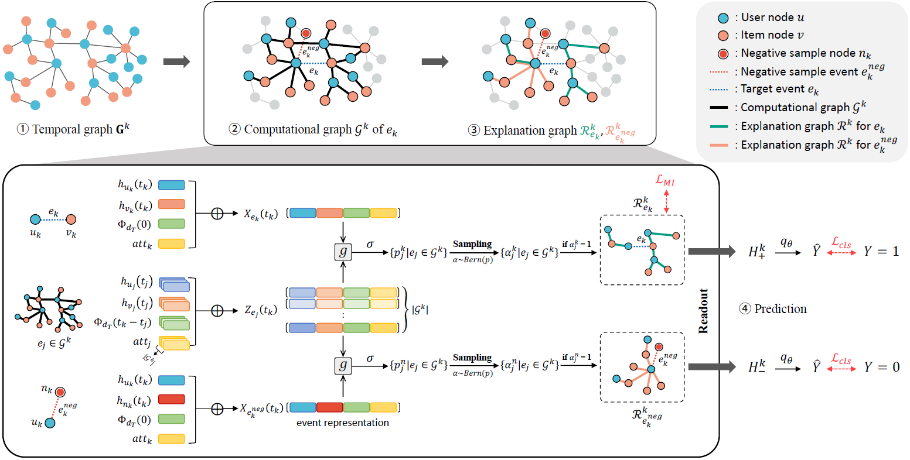

# Self-Explainable Temporal Graph Networks based on Graph Information Bottleneck

The official source code for Self-Explainable Temporal Graph Networks based on Graph Information Bottleneck.
 
Overview of Interpretable Prototype-based Graph Information Bottleneck.


Temporal Graph Neural Networks (TGNN) have the ability to capture both the graph topology and dynamic dependencies of interactions within a graph over time. There has been a growing need to explain the predictions of TGNN models due to the difficulty in identifying how past events influence their predictions. Since the explanation model for a static graph cannot be readily applied to temporal graphs due to its inability to capture temporal dependencies, recent studies proposed explanation models for temporal graphs. However, existing explanation models for temporal graphs rely on post-hoc explanations, requiring separate models for prediction and explanation, which is limited in two aspects: efficiency and accuracy of explanation. In this work, we propose a novel built-in explanation framework for temporal graphs, called Self-Explainable
Temporal Graph Networks based on Graph Information Bottleneck (TGIB). TGIB provides explanations for event occurrences by introducing stochasticity in each temporal event based on the Information Bottleneck theory. Experimental results demonstrate the superiority of TGIB in terms of both the link prediction performance and explainability compared to state-of-the-art methods. This is the first work that simultaneously performs prediction and explanation for temporal graphs in an end-to-end manner.

## Requirements
```
pandas==0.24.2
torch==1.1.0
tqdm==4.41.1
numpy==1.16.4
scikit_learn==0.22.1
```
## Dataset
* Download the datasets at this link https://zenodo.org/records/7213796#.Y1cO6y8r30o.

## Run
```
python -u learn_edge.py -d wikipedia --bs 200 --uniform  --n_degree 20 --agg_method attn --attn_mode prod --gpu 0 --n_head 2 --prefix hello_world
```
